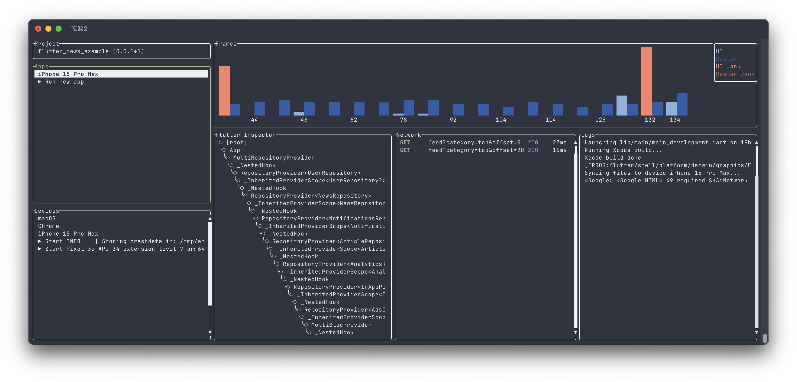

<h1 align="center">
  <a href="http://github.com/itome/flx"></a>
  <br>
  flx
  <br>
</h1>

<h4 align="center">Flutter DevTools for terminal lovers.</h4>

<h4 align="center">
  <a href="https://github.com/itome/flx/actions/workflows/ci.yml">
    
  </a>
  <a href="https://github.com/itome/flx/graphs/contributors">
    
  </a>
  <a href="https://opensource.org/license/mit">
    
  </a>
  <a href="https://github.com/sponsors/itome">
    
  </a>
</h4>

<p align="center">
  
</p>

> [!WARNING]
> This project is in the early phases of development. Please use it at your own risk.

# Installation

### Homebrew(macOS)

``` shell
brew install itome/tap/flx
```

# Features
- Flutter inspector
- Performance view
- Debug console view
- Network view
- [fvm](https://fvm.app/) support

# Sponcer
If you feel that flx is good, consider donating through [GitHub Sponsors](https://github.com/sponsors/itome) for its continuous development.

